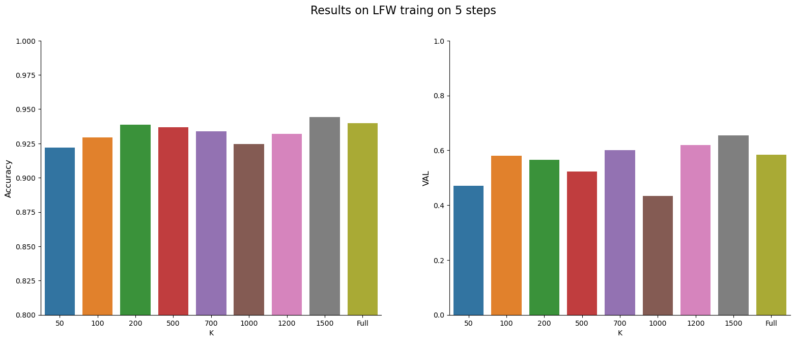
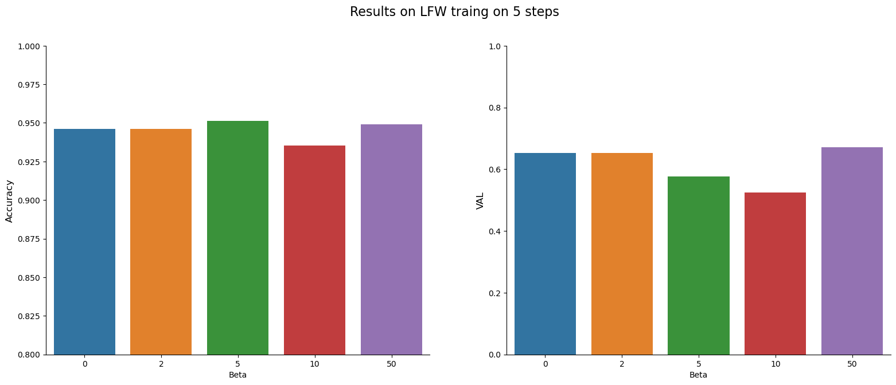
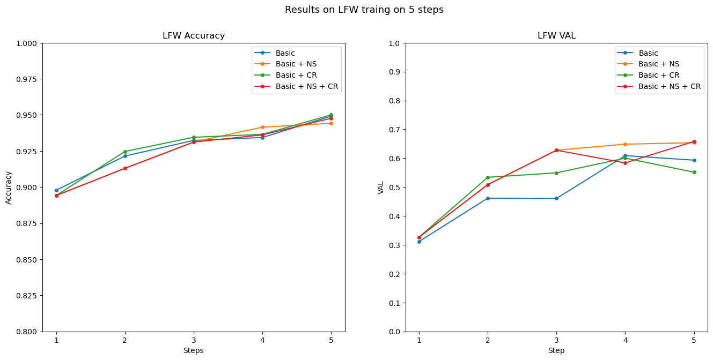
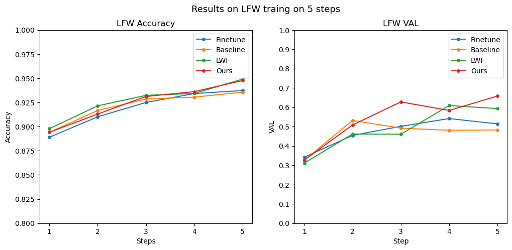

# Building a Continual Face Verification System


## Project Description

__Goal__: Build a continual face verification system that can learn new faces without forgetting the old ones and generalize well on new faces.

__Base architecture__: Inception-Resnet V1

__Dataset__: LFW, CASIA-Webface

__Preprocessing__: MTCNN face detection and alignment

__Evaluation__: Accuracy, VAL, FAR on LFW dataset using the unrestricted with labeled outside data protocol

__Methods__: 
  - Softmax loss, Label smoothing, Triplet loss, Center loss 
  - Distillation loss, Neighborhood Selection, Consistency Relaxation for continual learning


## Setup environment

```
pip install -r requirements.txt
```

## Dataset Prepare
- Download these datasets and put them in the `data` folder
  - [__LFW__](http://vis-www.cs.umass.edu/lfw/)
  - [__CASIA-Webface__](https://www.kaggle.com/datasets/itgaming/casia-webface-cropped-with-mtcnn)

## Training

__Arguments:__

```
usage: main.py [-h] [--seed SEED] [--preprocess PREPROCESS] [--num_tasks NUM_TASKS] [--batch_size BATCH_SIZE] [--epochs EPOCHS] [--optimizer OPTIMIZER]
               [--lr LR] [--momentum MOMENTUM] [--weight_decay WEIGHT_DECAY] [--dropout DROPOUT] [--smooth SMOOTH] [--triplet TRIPLET] [--margin MARGIN]     
               [--alpha ALPHA] [--center CENTER] [--beta BETA] [--center_lr CENTER_LR] [--distill DISTILL] [--ns NS] [--cr CR] [--lambda_old LAMBDA_OLD]     
               [--T T] [--K K] [--beta0 BETA0] [--eval_cycle EVAL_CYCLE] [--step_size STEP_SIZE] [--exp_name EXP_NAME]

options:
  -h, --help            show this help message and exit
  --seed SEED           Random seed
  --preprocess PREPROCESS
                        Preprocess CASIA-Webface dataset
  --num_tasks NUM_TASKS
                        Number of tasks to split the dataset
  --batch_size BATCH_SIZE
                        Batch size
  --margin MARGIN       Margin for triplet loss
  --alpha ALPHA         Alpha for triplet loss
  --center CENTER       Use center loss
  --beta BETA           Beta for center loss
  --center_lr CENTER_LR
                        Learning rate for center loss
  --distill DISTILL     Use distillation loss
  --ns NS               Use Neighborhood Selection
  --cr CR               Use Consistency Relaxation
  --lambda_old LAMBDA_OLD
                        Lambda for old loss
  --T T                 Temperature for new loss
  --K K                 Number of selected neighbors
  --beta0 BETA0         Beta0, margin for Consistency Relaxation
  --eval_cycle EVAL_CYCLE
                        Evaluate every n epochs
  --step_size STEP_SIZE
                        Step size for LR scheduler
  --exp_name EXP_NAME   Experiment name
```

### Training as 1 task

__Baseline__

```
python main.py --num_tasks 1 --batch_size 128 --epochs 24 --lr 0.1 --momentum 0.9 --weight_decay 3e-4 --eval_cycle 1
```


 __Baseline + Label smoothing__

```
python main.py --num_tasks 1 --batch_size 128 --epochs 24 --lr 0.1 --momentum 0.9 --weight_decay 3e-4 --eval_cycle 1 --smooth 1e-3
```


 __Baseline + Triplet Loss + Center Loss__

```
python main.py --num_tasks 1 --batch_size 128 --epochs 24 --lr 0.1 --momentum 0.9 --weight_decay 3e-4 --eval_cycle 1 --center True --beta 1e-3 --triplet True
```


 __Baseline + Label smoothing + Triplet Loss + Center Loss__

```
python main.py --num_tasks 1 --batch_size 128 --epochs 24 --lr 0.1 --momentum 0.9 --weight_decay 3e-4 --eval_cycle 1 --smooth 1e-3 --center True --beta 1e-3 --triplet True
```


### Training 5 tasks


__Finetune__

```
python main.py --num_tasks 5 --batch_size 128 --epochs 24 --lr 0.1 --momentum 0.9 --weight_decay 3e-4 --eval_cycle 3
```


__LWF__

```
python main.py --num_tasks 5 --batch_size 128 --epochs 24 --lr 0.1 --momentum 0.9 --weight_decay 3e-4 --eval_cycle 3 --distill True --lambda_old 0.1 --T 2
```


__Basic + NS__
  
```
python main.py --num_tasks 5 --batch_size 128 --epochs 24 --lr 0.1 --momentum 0.9 --weight_decay 3e-4 --eval_cycle 3 --distill True --lambda_old 0.1 --T 2 --ns True --K 1500
```


__Basic + CR__
  
```
python main.py --num_tasks 5 --batch_size 128 --epochs 24 --lr 0.1 --momentum 0.9 --weight_decay 3e-4 --eval_cycle 3 --distill True --lambda_old 0.1 --T 2 --cr True --beta0 5e-3
```


__Basic + NS + CR__

```
python main.py --num_tasks 5 --batch_size 128 --epochs 24 --lr 0.1 --momentum 0.9 --weight_decay 3e-4 --eval_cycle 3 --distill True --lambda_old 0.1 --T 2 --ns True --K 1500 --cr True --beta0 5e-3
```


## Experimental Results

### Training 1 task - LFW

| Method | Accuracy | VAL | FAR |
| --- | --- | --- | --- |
| Baseline | 0.96816 | 0.75500 | 0.00133 |
| Baseline + Label smoothing | 0.97316 | 0.82600 | 0.00133 |
| Baseline + Triplet Loss + Center Loss | __0.97483__ | 0.77700 | __0.00100__ |
| Baseline + Label smoothing + Triplet Loss + Center Loss | 0.97349 | __0.85300__ | 0.00133 |s

### Traning 5 tasks

__Basic + NS results of final task for different values of K__


| K | 50 | 100 | 200 | 500 | 700 | 1000 | 1200 | 1500 | Full |
| --- | --- | --- | --- | --- | --- | --- | --- | --- | --- |
| Accuracy | 0.92199 | 0.92950 | 0.93883 | 0.93666 | 0.93366 | 0.92449 | 0.93200 | __0.94416__ | 0.93966 |
| VAL | 0.471 | 0.581 | 0.565 | 0.522 | 0.600 | 0.434 | 0.619 | __0.653__ | 0.584 |




__Basic + NS + CR results of final task for different values of Beta__


| Beta | 0 | 2e-3 | 5e-3 | 10e-3 | 50e-3 |
| --- | --- | --- | --- | --- | --- |
| Accuracy | 0.94416 | 0.94416 | __0.94766__ | 0.93400 | 0.93733 |
| VAL | 0.653 | 0.653 | __0.658__ | 0.552 | 0.485 |




__Ablation study__


| Method | Accuracy | VAL |
| --- | --- | --- |
| Basic | 0.94917 | 0.59333 |
| Basic + NS | 0.94417 | 0.65367 |
| Basic + CR | __0.95__| 0.55167 |
| Basic + NS + CR | 0.94767 | __0.65800__ |




__Main Results__


| Method | Accuracy | VAL |
| --- | --- | --- |
| Baseline | 0.93567 | 0.48233 |
| Finetune | 0.93733 | 0.51433 |
| LWF | __0.94917__ | 0.59333 |
| Ours | 0.94767 | __0.65800__ |





## Run Server
```
python run_server.py
```


## References

__Papers:__

[1] Qiong Cao, Li Shen, Weidi Xie, Omkar M. Parkhi, and Andrew Zisserman. Vggface2: A dataset for recognising faces across pose and age, 2018.

[2] MohammadReza Davari, Nader Asadi, Sudhir Mudur, Rahaf Aljundi, and Eugene Belilovsky. Probing representation forgetting in supervised and unsupervised continual learning, 2022.

[3] Jiankang Deng, Jia Guo, Jing Yang, Niannan Xue, Irene Kotsia, and Stefanos Zafeiriou. ArcFace: Additive angular margin loss for deep face recognition. IEEE Transactions on Pattern Analysis and Machine Intelligence, 44(10):5962–5979, oct 2022.

[4] Ian J. Goodfellow, Mehdi Mirza, Da Xiao, Aaron Courville, and Yoshua Bengio. An empirical investigation of catastrophic forgetting in gradient-based neural networks, 2015.

[5] Geoffrey Hinton, Oriol Vinyals, and Jeff Dean. Distilling the knowledge in a neural network, 2015.

[6] Gary B Huang, Marwan Mattar, Tamara Berg, and Eric Learned-Miller. Labeled faces in the wild: A database forstudying face recognition in unconstrained environments. In Workshop on faces in’Real-Life’Images: detection, alignment, and recognition, 2008.

[7] Zhizhong Li and Derek Hoiem. Learning without forgetting, 2017.

[8] Hao Luo, Wei Jiang, Youzhi Gu, Fuxu Liu, Xingyu Liao, Shenqi Lai, and Jianyang Gu. A strong baseline and batch normalization neck for deep person re-identification. IEEE Transactions on Multimedia, 22(10):2597–2609, oct 2020.

[9] Florian Schroff, Dmitry Kalenichenko, and James Philbin. Facenet: A unified embedding for face recognition and clustering. 2015 IEEE Conference on Computer Vision and Pattern Recognition (CVPR), Jun 2015.

[10] Zhiqiang Shen, Zechun Liu, Dejia Xu, Zitian Chen, Kwang-Ting Cheng, and Marios Savvides. Is label smoothing truly incompatible with knowledge distillation: An empirical study, 2021.

[11] Christian Szegedy, Sergey Ioffe, Vincent Vanhoucke, and Alex Alemi. Inception-v4, inception-resnet and the impact of residual connections on learning, 2016.

[12] Christian Szegedy, Vincent Vanhoucke, Sergey Ioffe, Jon Shlens, and Zbigniew Wojna. Rethinking the inception architecture for computer vision. In 2016 IEEE Conference on Computer Vision and Pattern Recognition (CVPR), pages 2818–2826, 2016.

[13] Xiaogang Wang. Intelligent multi-camera video surveillance: A review. Pattern Recognition Letters, 34(1):3–19, 2013. Extracting Semantics from Multi-Spectrum Video.

[14] Yandong Wen, Kaipeng Zhang, Zhifeng Li, and Yu Qiao. A discriminative feature learning approach for deep face recognition. In Computer Vision–ECCV 2016: 14th European Conference, Amsterdam, The Netherlands, October 11–14, 2016, Proceedings, Part VII 14, pages 499–515. Springer, 2016.

[15] Dong Yi, Zhen Lei, Shengcai Liao, and Stan Z. Li. Learning face representation from scratch, 2014.

[16] Li Yuan, Francis E. H. Tay, Guilin Li, Tao Wang, and Jiashi Feng. Revisiting knowledge distillation via label smoothing regularization, 2021.

[17] Kaipeng Zhang, Zhanpeng Zhang, Zhifeng Li, and Yu Qiao. Joint face detection and alignment using multitask cascaded convolutional networks. IEEE Signal Processing Letters, 23(10):1499–1503, oct 2016.

[18] Bo Zhao, Shixiang Tang, Dapeng Chen, Hakan Bilen, and Rui Zhao. Continual representation learning for biometric identification, 2020.

[19] Bo Zhao, Shixiang Tang, Dapeng Chen, Hakan Bilen, and Rui Zhao. Continual representation learning for biometric identification. In Proceedings of the IEEE/CVF Winter Conference on Applications of Computer Vision, pages 1198–1208, 2021.

__Github repositories:__

- [faceNet-pytorch](https://github.com/timesler/facenet-pytorch)